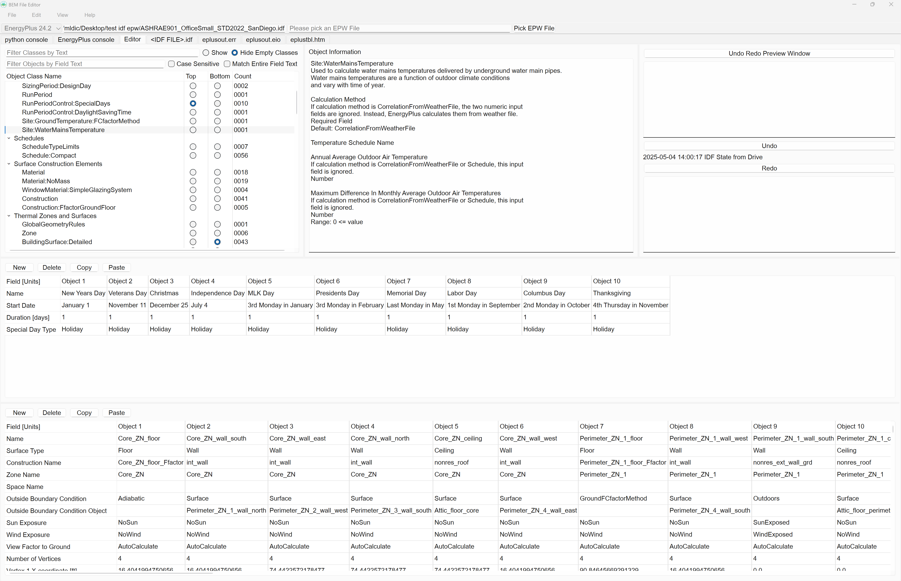
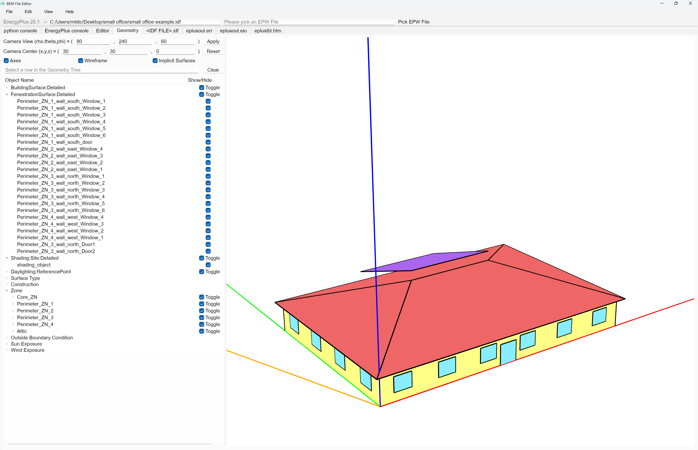
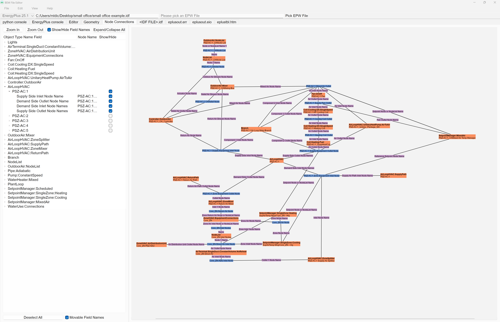
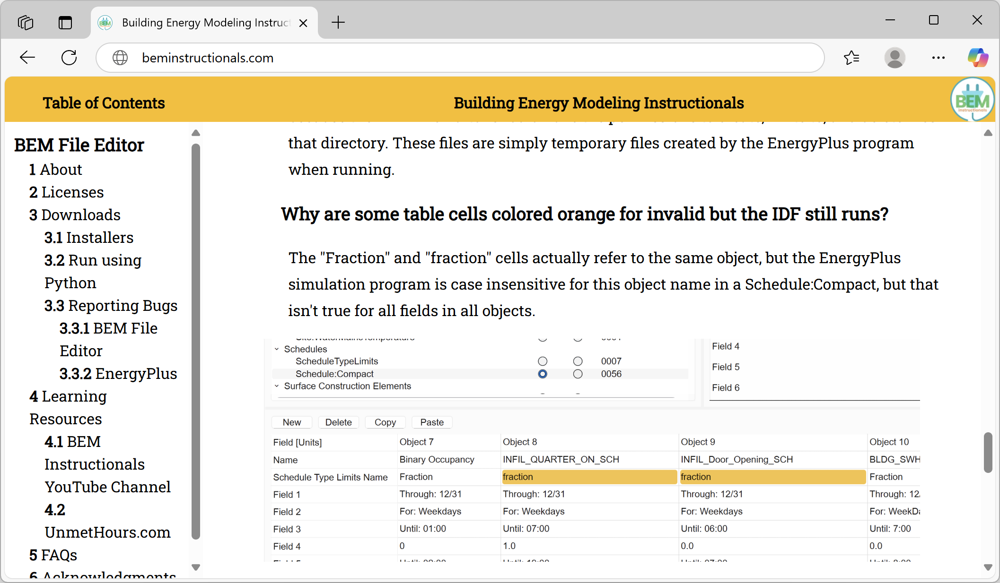
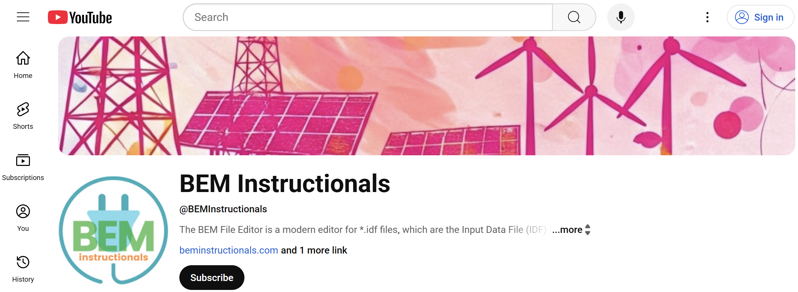

# BEM File Editor

The READMEs for GitHub repos have limited functionality and are meant to provide users with essential information, such as its purpose, usage, and licenses.

For a much more comprehensive overview, please see the accompanying [BEM Instructionals website](https://beminstructionals.com/) or the [BEM Instructionals YouTube Channel](https://www.youtube.com/@BEMInstructionals).

## About

The BEM File Editor is a modern editor for *.idf files, which are the Input Data File (IDF) files for the [EnergyPlus](https://energyplus.net/) whole building energy simulation program. The BEM File Editor installer does not contain any version of the EnergyPlus simulation program. Each version of EnergyPlus you want to use must be installed separately.

### Editor Tab

### Geometry Tab

### Node Connections Tab

## Version 1.3.0

### Installers

Windows 11 x86_64 [BEM-File-Editor-Setup.exe](https://github.com/BEMinstructionals/BEMinstructionals.github.io/releases/download/v1.3.0/BEM-File-Editor-Setup.exe)

macOS Sequoia ARM64 [BEM-File-Editor.dmg](https://github.com/BEMinstructionals/BEMinstructionals.github.io/releases/download/v1.3.0/BEM-File-Editor.dmg)

Ubuntu 24.04.2 LTS amd64 [BEM-File-Editor.deb](https://github.com/BEMinstructionals/BEMinstructionals.github.io/releases/download/v1.3.0/BEM-File-Editor.deb)

### Run using Python without Installing

This option is useful for users with employers that limit what can be installed on their computer and for employers that automatically delete unapproved applications.

Download [BEM-File-Editor-1.3.0.zip](https://github.com/BEMinstructionals/BEMinstructionals.github.io/releases/download/v1.3.0/BEM-File-Editor-1.3.0.zip)

Steps are to install Pyside6 using "pip install pyside6", then "python main.py" to start the BEM File Editor. (Using Python 3.13 is recommended for compatibility.)

### Reporting Bugs

#### BEM File Editor

I have tested the most on Windows 11 x86_64 because that is the OS I develop on, and I do test new features on macOS and Ubuntu, but I suspect there are still some bugs and annoying behaviors lurking in the code. If you encounter a bug in the BEM File Editor, you can try viewing the console output by enabling the View-&gt;Application Settings "Show Python Console Tab" checkbox. If there is no exception thrown then I probably made a logical error in the code, in which case all you'll see in the "python console" tab is datetimes of when the BEM File Editor was opened. In both cases, please document the steps to reproduce the behavior, [create an issue on the BEM File Editor GitHub repo](https://github.com/BEMinstructionals/BEMinstructionals.github.io/issues), and I will try to fix it.

#### EnergyPlus

EnergyPlus is completely separate from the BEM File Editor, so if you think you've found a bug with one of the EnergyPlus programs, you can [create an issue on the EnergyPlus GitHub repo](https://github.com/NREL/EnergyPlus/issues).

## Learning Resources

### BEM Instructionals Website and YouTube Channel

The [BEM Instructionals website](https://beminstructionals.com/) is a much more comprehensive overview of the BEM File Editor and related topics.

But the real purpose of the webpage will be to organize the [BEM Instructionals YouTube Channel](https://www.youtube.com/@BEMInstructionals) videos. Right now there is a tour of the BEM File Editor. More videos to come soon.

### UnmetHours.com
[Unmet Hours](https://unmethours.com/questions/) is a forum for the building energy modeling community, mostly focusing on EnergyPlus and programs that use EnergyPlus. If you have a question, you can search for the answer, or post your own question. If you want me to receive an email notification when you post something, include "@Mitchal Dichter" in the text without the quotes. You'll know it worked if the [@Mitchal Dichter](https://unmethours.com/users/2900/mitchal-dichter/) text turns blue shortly after you post.

## Licenses

The BEM File Editor main.py code is licensed under a BSD-3-Clause license. See the [LICENSE](https://github.com/BEMinstructionals/BEMinstructionals.github.io/blob/master/LICENSE.md) file for details.

The BEM Instructionals logo is licensed under a [Creative Commons Attribution-ShareAlike 4.0 International](https://creativecommons.org/licenses/by-sa/4.0/) license.

PySide6 is licensed under the [GNU Lesser General Public License version 3](https://www.gnu.org/licenses/lgpl-3.0.en.html#license-text).

## Acknowledgments

The BEM File Editor was inspired by the [IDF+ Editor](https://github.com/mattdoiron/idfplus) created by Matt Doiron.

A big Thank You! to all users who document and report bugs and annoying behavior when they occur.
